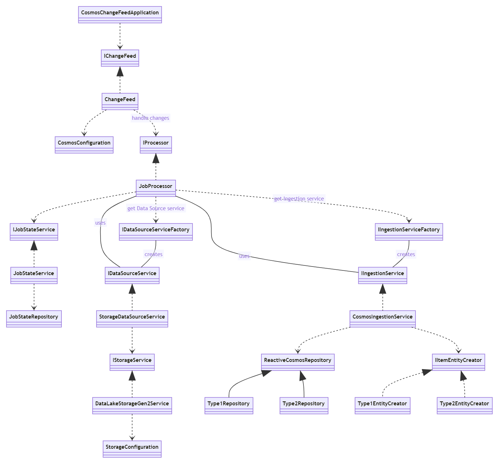

# CosmosDB change feed example

This project contains an [Azure Spring Cloud](https://azure.microsoft.com/en-us/services/spring-cloud/) application that processes changes in an [Azure CosmosDB](https://azure.microsoft.com/en-us/services/cosmos-db/) container with a change feed.

Check [CosmosDB section](#CosmosDB) for more details on how change feed works.

## How the example works

1) Some .json files with different types of items will be uploaded into a container in [Azure Data Lake Storage Gen2](https://docs.microsoft.com/en-us/azure/storage/blobs/data-lake-storage-introduction).
2) Then, one job per file will be inserted into a container in CosmosDB (a.k.a. feed container). Each job will point to one of the files and specify which type of item it contains, the container and the path to the file.
3) The change feed in the application will get the jobs and notify different processors to deal with each of them.
4) The example includes one processor that will get the job, download the data it points to from Data Lake Storage Gen2 and insert the items from the downloaded data into different containers within CosmosDB depending on their type.

Code can be easily extended to support different types of items, additional data sources other than Azure Data Lake Storage and additional data targets for the items other than CosmosDB.

## Components


## Building, debugging and running the example

### Setup

- You may levarage the Visual Studio Code Developer Container in `/.devcontainer` to use a Docker container as a full featured development environment. You will need [Docker](https://www.docker.com/), [Visual Studio Code](https://code.visualstudio.com/) and the [Remote Development Extension Pack for Visual Studio Code](https://marketplace.visualstudio.com/items?itemName=ms-vscode-remote.vscode-remote-extensionpack). Check [Visual Studio Code Development Containers section](#Visual-Studio-Code-Development-Containers) for more details.

- `/samples` folder contains sample jobs and their related data.

### Visual Studio Code

- Create a copy of `./cosmos-change-feed/src/main/resources/application-local.yml.template` called `application-local.yml` and set the settings to your own values.
- Then create a file `.vscode/launch.json` and set it to the following:

    ```json
    {
    "version": "0.2.0",
    "configurations": [
        {
            "type": "java",
            "name": "cosmos-change-feed",
            "request": "launch",
            "cwd": "${workspaceFolder}",
            "console": "internalConsole",
            "mainClass": "com.microsoft.cosmos.cosmoschangefeed.CosmosChangeFeedApplication",
            "projectName": "cosmos-change-feed",
            "vmArgs": [
                "-Dspring.profiles.active=local"
            ]
        }
    ]
    }
    ```

- Now you can run (Ctrl+F5) or debug (F5) the application. 

- You may also run or debug the tests in the Test section of Visual Studio Code.

### Command line

- Go to `/cosmos-change-feed`.
- Create a copy of `./cosmos-change-feed/src/main/resources/application-local.yml.template` called `application-local.yml` and set the settings to your own values.
- Use the following `mvn` commands:

  - To package the application:

    ``` bash
    mvn clean package
    ```

  - To run the application:

    ```bash
    mvn spring-boot:run -Dspring-boot.run.jvmArguments="-DSpring.profiles.active=local"
    ```

  - To run the tests:

    ```bash
    mvn test
    ```
## Additional information

### Visual Studio Code Development Containers

- [Developing inside a Container](https://code.visualstudio.com/docs/remote/containers). Check [system requirements](https://code.visualstudio.com/docs/remote/containers#_system-requirements) and [installation steps](https://code.visualstudio.com/docs/remote/containers#_installation).
- [Remote development in Containers](https://code.visualstudio.com/docs/remote/containers-tutorial).
- [Create a development container](https://code.visualstudio.com/docs/remote/create-dev-container).
- [Advanced Container Configuration](https://code.visualstudio.com/docs/remote/containers-advanced).
- [devcontainer.json reference](https://code.visualstudio.com/docs/remote/devcontainerjson-reference).

### Java in Visual Studio Code

- [Getting Started](https://code.visualstudio.com/docs/java/java-tutorial).
- [Formatting and linting](https://code.visualstudio.com/docs/java/java-linting).
- [Project management](https://code.visualstudio.com/docs/java/java-project).
- [Build tools](https://code.visualstudio.com/docs/java/java-build).
- [Run and debug](https://code.visualstudio.com/docs/java/java-debugging).
- [Testing](https://code.visualstudio.com/docs/java/java-testing).
- [Working with Application Servers](https://code.visualstudio.com/docs/java/java-tomcat-jetty).
- [Spring Boot](https://code.visualstudio.com/docs/java/java-spring-boot).
- [Extensions](https://code.visualstudio.com/docs/java/extensions).

### CosmosDB

- [Change feed processor in Azure Cosmos DB](https://docs.microsoft.com/en-us/azure/cosmos-db/change-feed-processor).
- [Spring Data Azure Cosmos DB developer's guide](https://docs.microsoft.com/en-us/azure/developer/java/spring-framework/how-to-guides-spring-data-cosmosdb)

### Azure Data Lake Storage Gen2

- [Use Java to manage directories, files, and ACLs in Azure Data Lake Storage Gen2](https://docs.microsoft.com/en-us/azure/storage/blobs/data-lake-storage-directory-file-acl-java).